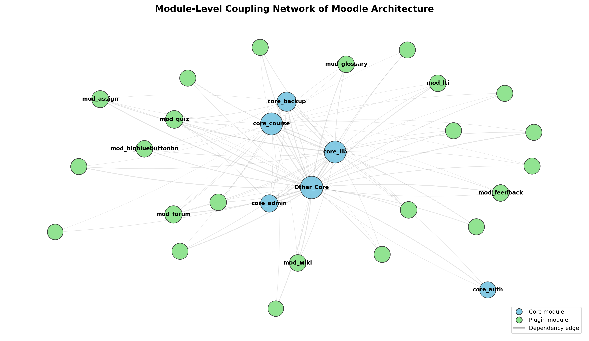

# Analisis Modularitas Arsitektur Moodle

Kode sumber, dataset, dan hasil pendukung untuk paper
**"Analisis Modularitas Moodle Berdasarkan Struktur Direktori dan Dependensi File"**
(*Jurnal Pustaka Data*).

Penelitian ini mengusulkan analisis statis ringan berbasis *regular expression*
untuk mengekstrak dependensi tingkat file pada Moodle dan mengevaluasi
modularitasnya menggunakan *Information Flow Metrics* (Fan-In, Fan-Out,
Instability, Cohesion) — sebagai alternatif yang lebih ringan dibandingkan
analisis berbasis *Abstract Syntax Tree* (AST).

---

## 📌 Objek Penelitian
- **Sistem:** Moodle (github.com/moodle/moodle)
- **Versi:** 5.3dev (Build 20260616, commit `08d193e8f`)
- **Skala:** ±50.028 file PHP, 1.247.184 baris relasi dependensi
- **Lingkungan:** Google Colab (CPU standar)
- **Waktu pemrosesan analisis:** ±73,70 detik (di luar waktu unduh repositori)

---

## 🧪 Ringkasan Metode
1. **Fase 1 — Data Mining:** kloning repositori, pemetaan struktur direktori,
   dan ekstraksi dependensi (relasi inklusi `require`/`include` serta
   pemanggilan fungsi) menggunakan *regular expression*.
2. **Fase 2 — Analisis Arsitektur:** agregasi relasi file menjadi graf berarah
   tingkat modul, lalu perhitungan metrik modularitas per modul (Core & Plugin).

---

## 📊 Temuan Utama
- Komponen inti sangat stabil (Instability ≈ 0,059; Fan-In tinggi).
- `core_lib` tidak stabil (Instability ≈ 0,816; Fan-Out sangat tinggi),
  mengindikasikan gejala *"god object"*.
- Seluruh plugin (`mod_*`) memiliki Fan-In mendekati nol dan Instability > 0,98,
  menunjukkan isolasi yang baik — kegagalan plugin tidak memengaruhi inti.

> Catatan: angka final mengacu pada `data/rapor_metrik_modularitas_master.csv`.

---

## 🖼️ Visualisasi Jaringan Coupling Antar Modul

*Gambar 1. Graf berarah dependensi antarmodul Moodle.*

---

## 📁 Struktur Repositori
- `notebooks/`
  - `Fase_1_Data_Mining.ipynb` — kloning, pemetaan, ekstraksi dependensi
  - `Fase_2_Analisis_Arsitektur.ipynb` — pemodelan graf & perhitungan metrik
- `data/`
  - `rapor_metrik_modularitas_master.csv` — rapor metrik final (Core + Plugin)
  - `rapor_metrik_modularitas.csv`
  - `analisis_modularitas.csv`, `analisis_modularitas_komplit.csv`
  - `moodle_directory_structure_api.csv` — struktur direktori (node list)
- `figures/`
  - `figure1_moodle_coupling_network_paper.png` / `.pdf`
  - `visualisasi_modularitas.png`

**Dataset relasi mentah penuh** (`moodle_dependencies_full.csv`,
`moodle_dependencies.csv`) berukuran > 100 MB sehingga **tidak disimpan di
GitHub**, melainkan tersedia di Zenodo (lihat DOI di bawah).

---

## ▶️ Cara Menjalankan
1. Buka notebook di **Google Colab**.
2. Jalankan **Fase 1** (kloning + ekstraksi) — hasilnya `moodle_dependencies_full.csv`.
3. Jalankan **Fase 2** (pemodelan + metrik) — hasilnya rapor metrik modularitas.
4. **Dependensi:** Python 3, `pandas`, `networkx`, `matplotlib`.

---

## 🔁 Reproduktibilitas
- Repositori: `https://github.com/<username-kamu>/moodle-architecture-analysis`
- DOI (Zenodo): `10.5281/zenodo.<nomor-asli>`

Karena `git clone --depth 1` menarik versi terbaru, gunakan commit `08d193e8f`
(Moodle 5.3dev) untuk hasil yang identik.

---

## 👥 Penulis
- Arzaki Muhamad Fadil
- Muhammad Fachri Hafizh Saleh
- Pembimbing: Muhammad Ainul Yaqin

Program Studi Teknik Informatika, UIN Maulana Malik Ibrahim Malang.

---

## 📄 Lisensi
Dirilis di bawah **MIT License** — lihat file [`LICENSE`](LICENSE).
